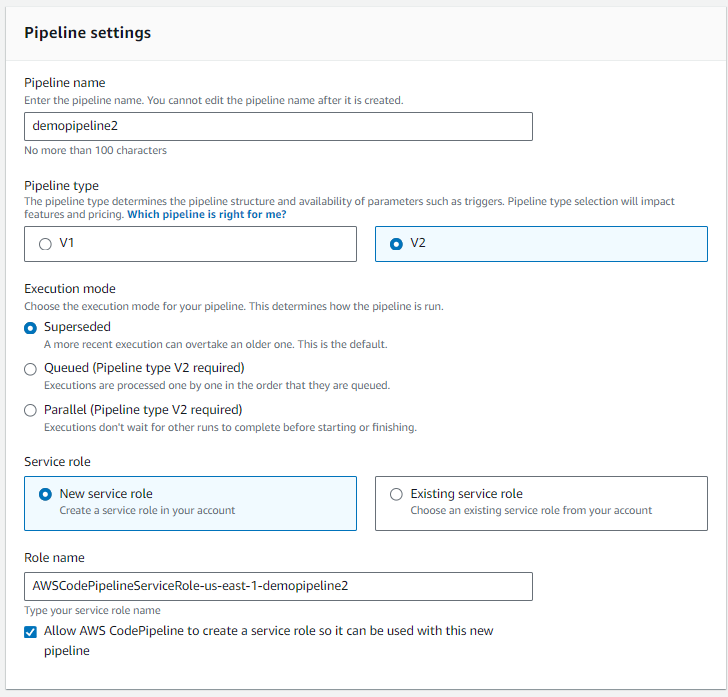
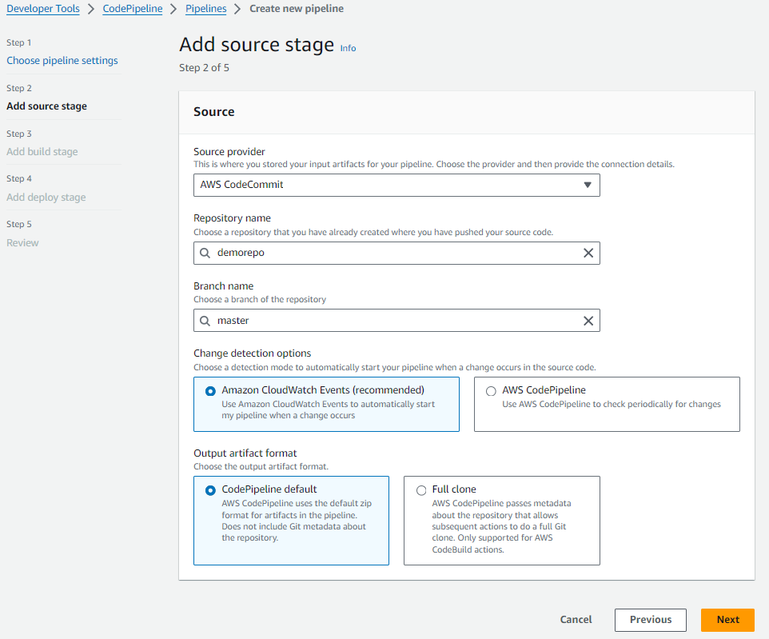
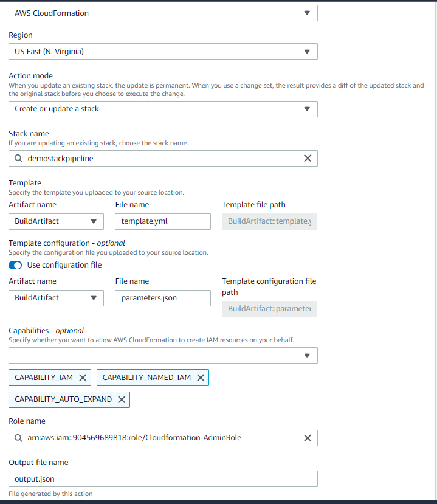

# DEVOPS EN AWS: CODECOMMIT+CODEBUILD+CODEDEPLOY+CODEPIPELINE


## GENERAR CREDENCIALES CODECOMMIT
1. Debes tener previamente seteadas las credenciales de AWS en el CLI. Credential helper en el contexto de AWS CodeCommit y Git permite utilizar las credenciales de AWS configuradas en tu máquina para interactuar con GIT.

```bash
pip install --user git-remote-codecommit
git config --global credential.helper '!aws codecommit credential-helper $@'
git config --global credential.UseHttpPath true
git clone codecommit::us-east-1://demorepo

OPCIONAL:
SET PATH=C:\Users\User\AppData\Roaming\Python\Python312\Scripts;%PATH%
```


2. Comenzamos creando un pipeline en la consola de AWS.
Usamos la V2, definimos el service role.
NO defino variables.




3. Pasando al stage de source, en este caso definimos como source es CodeCommit. 


4. Stage Codebuild, escogemos un proveedor de building que seria CodeBuild. Aqui mismo tocara crear un proyecto.
- A nivel de environment: modelo on-demand, imagen gestionada, EC2 compute, tambien creo un nuevo service role.
- Agregar la variable de ambiente
- Importante agregar politicas al rol de CodeBuild para acceso fullS3.

5. Stage Codedeploy


## DOCUMENTACION
1. Diferencias entre versiones V1 y V2: https://docs.aws.amazon.com/codepipeline/latest/userguide/pipeline-types-planning.html

2. 