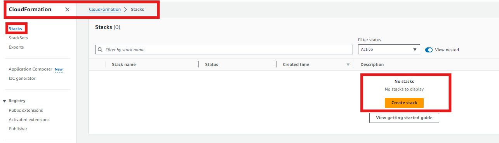
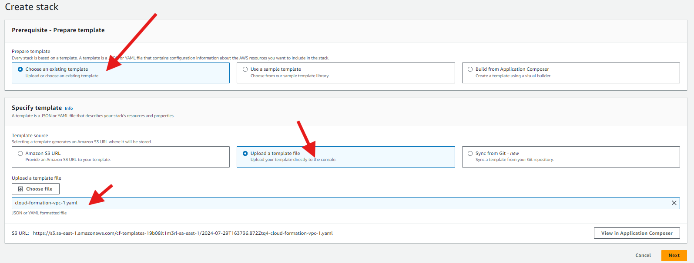
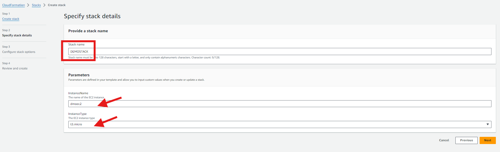
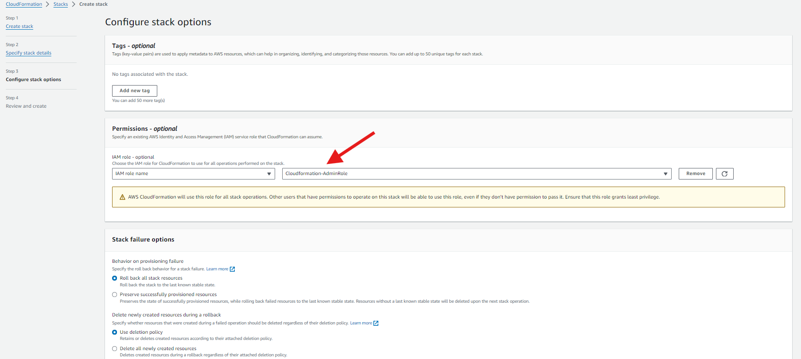
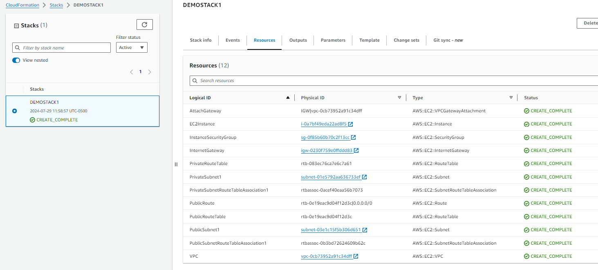
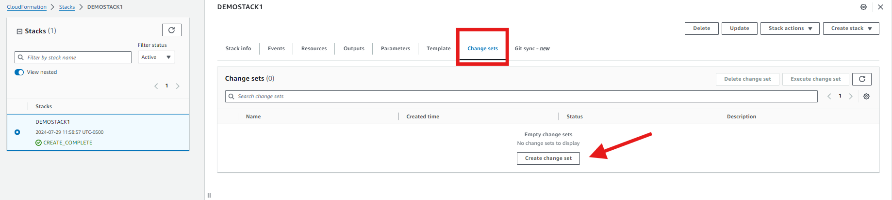
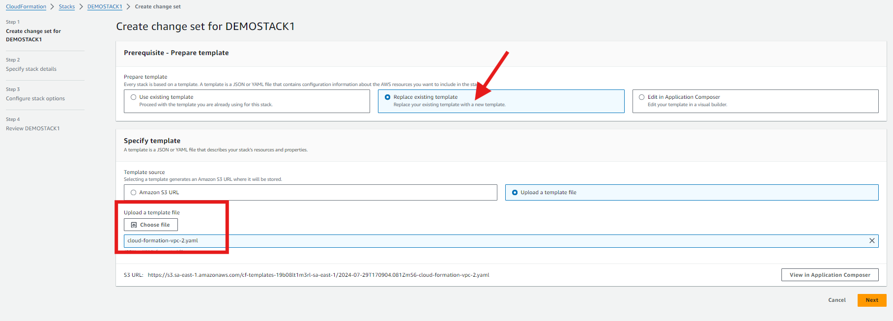
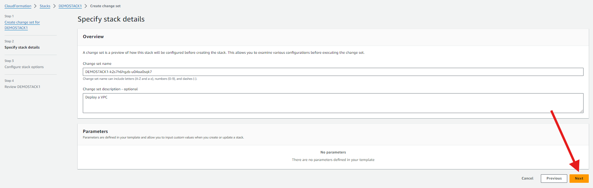
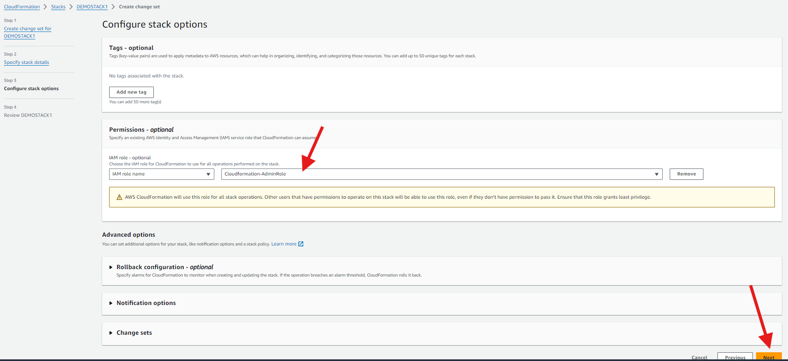
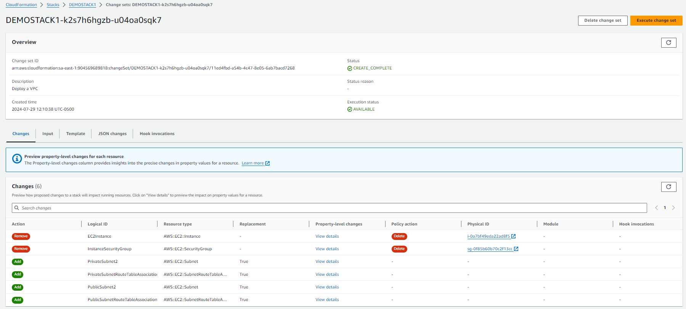

# CLOUDFORMATION LAB

1. Vamos a la consola de Cloudformation y creamos un nuevo stack (conjunto logico de recursos)

2. Hay 3 maneras de desplegar un stack, lo haremos con la opcion de cargar la plantilla de forma manual. Subimos el archivo "cloud-formation-vpc-1.yaml" de la carpeta VPC_changeset del repositorio actual.

3. Definimos los parametros para personalizar los recursos que levantara la plantilla.

4. En los siguientes pasos solo especificaremos el rol que AWS Cloudformation usara para levantar diferentes recursos.

    #### AMI IDs for Different Regions: Amazon Linux 2023

    | Region         | AMI ID               |
    |----------------|-----------------------|
    | us-east-1      | ami-0427090fd1714168b |
    | us-east-2      | ami-00db8dadb36c9815e |
    | us-west-1      | ami-03ed1381c73a5660e  |
    | eu-west-2      | ami-074be47313f84fa38  |
    | sa-east-1      | ami-02031d73889932104  |

5. Enviamos las configuraciones y deberia comenzar a crearse el stack.

6. CREAR UN CHANGESET: Creamos una version del stack que podria modificar/eliminar/crear recursos dependiendo de los cambios que hayamos realizado en la plantilla.

7. Seleccionamos la opcion de reemplazar la plantilla y subimos la version 2. 

8. Con estos cambios enviados ya podemos visualizar los cambios que se haran en el stack: 
