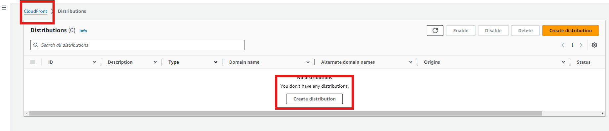
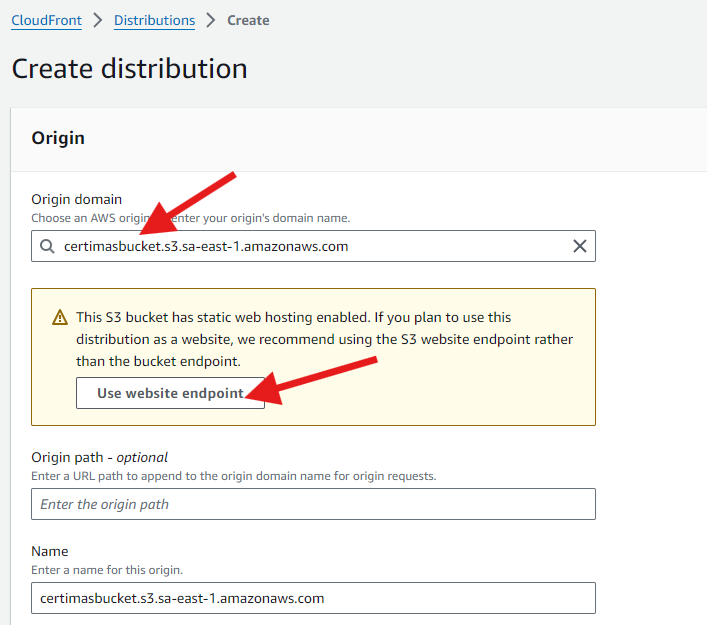
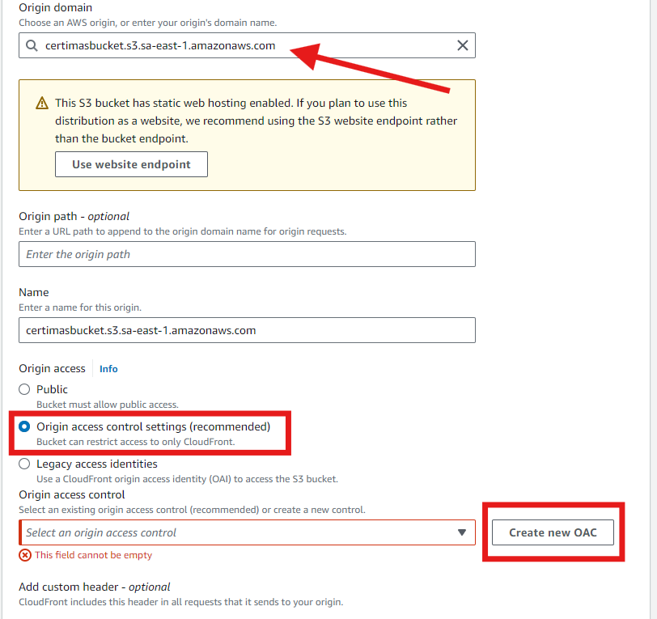
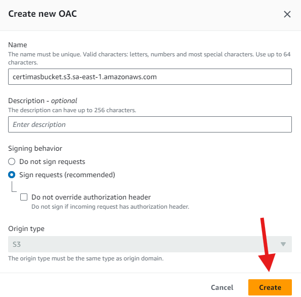
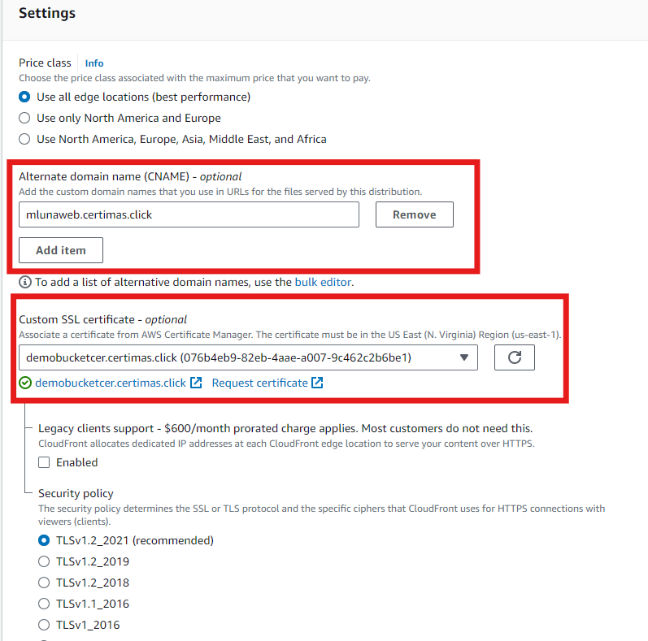

# WEB PAGE: S3 + CLOUDFRONT
## Configuracion de bucket S3
1. Creamos un bucket S3 en la nuestra region favorita, y subimos los archivos de la carpeta "webejemplo" que encontramos en el repositorio.
OJO: Al momento de crear el bucket aseguremonos de hacerlo publico. 


Subimos los archivos estaticos, puede ser mediante consola o mediante el cli.
```bash
aws s3 sync webejemplo/ s3://certimasbucket
```

2. Ya en el bucket, editamos las politicas para permitir el acceso publico a los objetos del bucket.
Tambien debemos habilitar la opcion de hosting de web estatica, esto en la seccion "Properties" y configuramos los nombres de los archivos.


## Creacion y configuracion de la distribucion de Cloudfront
1. Vamos a la consola de Cloudfront y creamos una nueva distribucion.


2. La primera opcion que salta para crear la distribucion es definir el ORIGEN, que es donde se encuentran los recursos que queremos distribuir a traves de Cloudfront, buscamos nuestro bucket.



3. Como buena practica de seguridad podemos crear un OAC, que 


Copiamos la politica originada por AWS y la usaremos en el bucket, para permitir el acceso a los recursos desde esta distribucion de Cloudfront.

4. Muy importante, debemos agregar un CNAME para que la funcionalidad de integracion entre Route53 y Cloudfront pueda funcionar correctamente. Tambien agregamos el certificado.


5. Tambien definimos el root object, a donde se enviaran las solicitudes de cloudfront, en nuestro caso el index.


6. Una vez creada la distribucion, podemos obtener la politica para el bucket.


La politica en cuestion se vera algo asi: 
```json
{
        "Version": "2008-10-17",
        "Id": "PolicyForCloudFrontPrivateContent",
        "Statement": [
            {
                "Sid": "AllowCloudFrontServicePrincipal",
                "Effect": "Allow",
                "Principal": {
                    "Service": "cloudfront.amazonaws.com"
                },
                "Action": "s3:GetObject",
                "Resource": "arn:aws:s3:::certimasbucket/*",
                "Condition": {
                    "StringEquals": {
                      "AWS:SourceArn": "arn:aws:cloudfront::904569689818:distribution/E33CLWUJ1U9SUJ"
                    }
                }
            }
        ]
      }
```