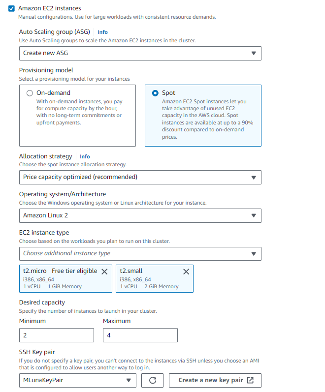
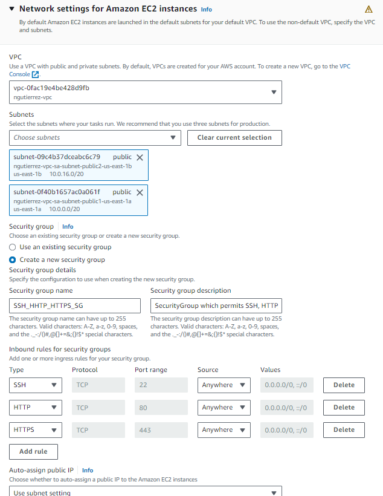
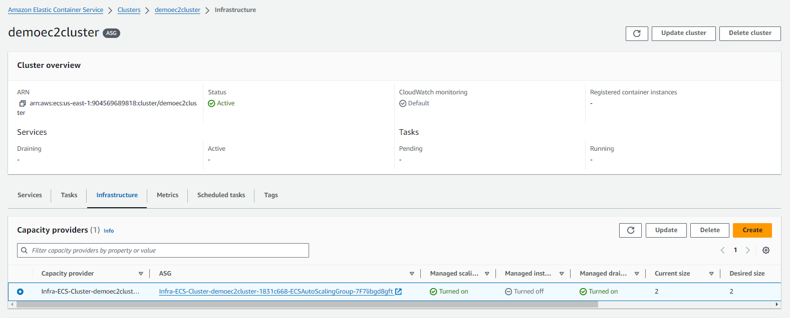
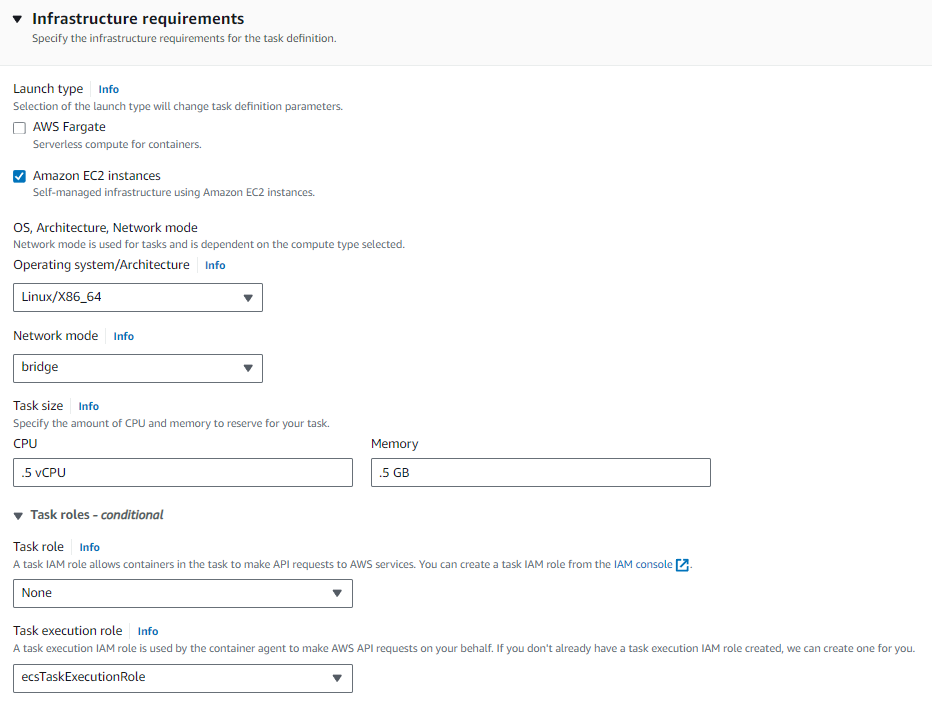
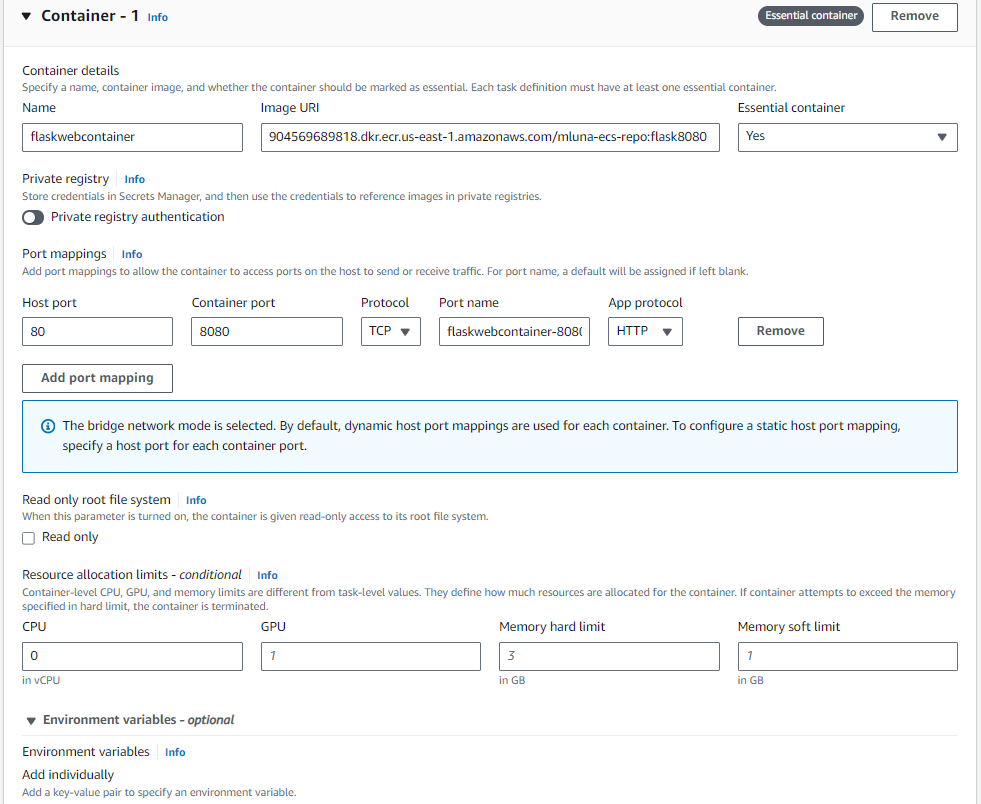
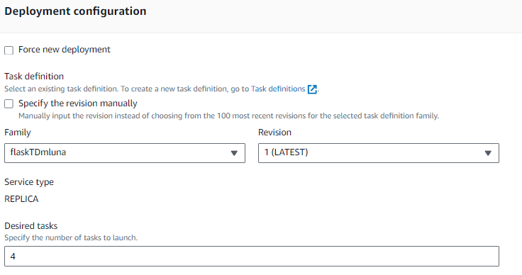

# ECS LABORATORIO 

Region: Virginia (us-east-1)
Default VPC a y b como subredes publicas.
## ECS + EC2
1. CREANDO EL CLUSTER ECS, que se encargara de orquestar la infraestructura de los contenedores.

    Seleccionamos como tipo de infraestructura AWS EC2 Instances.
    - Aqui podemos crear un nuevo ASG o seleccionar uno ya creado. Creamos uno esta vez con el modelo spot.
    
    Como vemos aqui tebenos que seleccionar el tipo de instancias y SO, ademas de parametros de ASG.
    
    A nivel de network settings, definimos la VPC, subredes y Grupos de seguridad.
     
    
Al final de este paso deberiamos poder ver el cluster ECS con el grupo de AS como capacity providers, las instancias ya deberian estar corriendo tambien Y DEBEN MOSTRARSE EN CONTAINER INSTANCES DE ECS, sino es asi suele ser un problema de red.

2. CREANDO EL TASK DEFINITION
Aqui es importante definir EC2 como infraestructura, el NETWORK MODE (Bridge si usaremos mapeo de puertos dinamicos), el sizing de la tarea y el TASK EXECUTION ROL (yo uso un rol con la politica gestionada AmazonECSTaskExecutionRolePolicy).
    
Aqui tambien definimos los containers. 
    
    
**Si queremos usar mapeo de puertos dinamicos se debe definir aqui, en el task definition con HOST_PORT=0**

3. LANZAMOS UN SERVICIO, definimos el task definition a usar, cuantos task deseamos que corran en este servicio y OPCIONALMENTE UN BALANCEADOR DE CARGA.

## ECS + FARGATE

2. CREANDO EL TASK DEFINITION para Fargate, vemos que a diferencia de crearlo con ECS NO nos pide puerto de HOST, ya que eso lo maneja Fargate automaticamente.