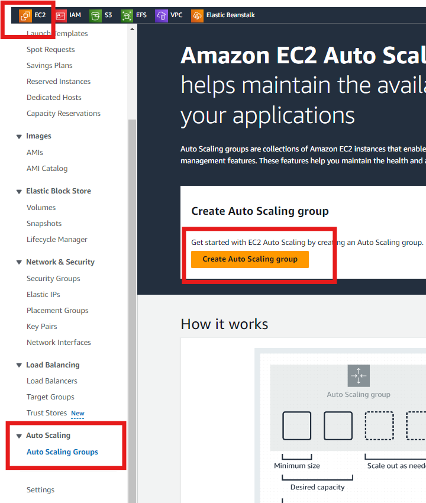
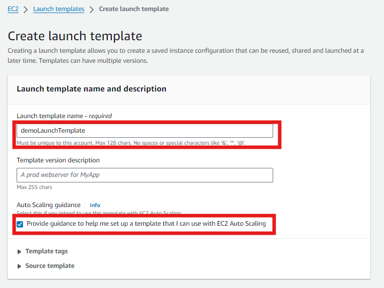
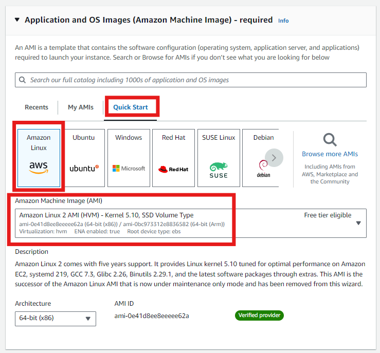
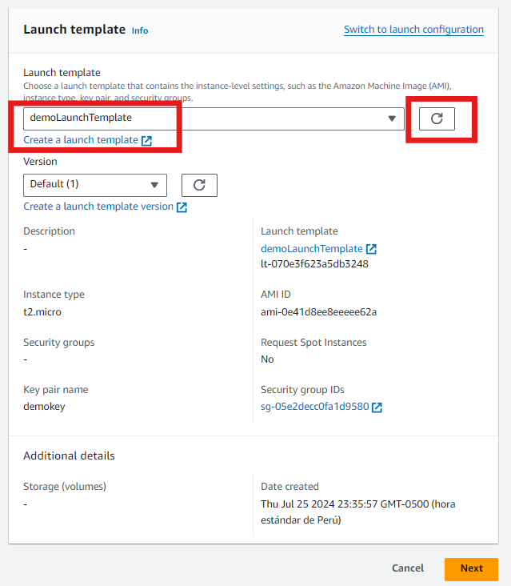
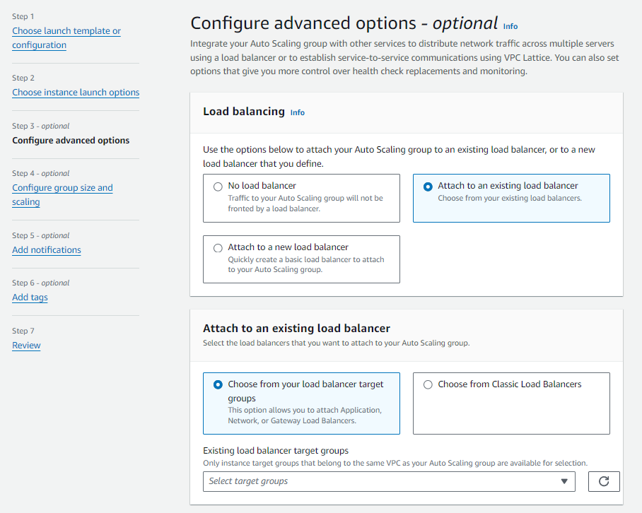

# LABORATORIO: EC2-LB-CM-ROUTE53
## Creacion del grupo de autoescalamiento
1. Vamos a la consola de EC2, en la seccion AutoScaling Group y creamos un nuevo grupo.


2. Iniciamos con la plantilla de creacion, le ponemos un nombre al grupo, crearemos desde esta vista un LAUNCH TEMPLATE, lo cual abrira una nueva pestana.


    ### CREACION DEL LAUNCH TEMPLATE  
    1. Pasamos a crear el launch template, donde definimos las configuraciones de las instancias que seran lanzadas por AWS cuando se requiera escalar.
    Enviamos un nombre a la plantilla y marcamos la casilla de GUIA PARA EC2 AUTOSCALING.
    

    2. Como AMI usamos Amazon Linux 2 que encontramos en Quick Start.
    

    3. Escogemos el tipo de instancia y un par de llaves. 
    CONFIGURACION DE RED: NO INCLUIREMOS CONFIGURACION DE SUBNET NI GRUPOS DE SEGURIDAD (IMPORTANTE).
    
    

    4. En advaced details agregamos el siguiente script en USER DATA.

    ```bash
    #!/bin/bash
    yum update -y
    yum install -y httpd
    systemctl start httpd
    systemctl enable httpd
    INSTANCE_ID=$(curl http://169.254.169.254/latest/meta-data/instance-id)
    PRIVATE_IP=$(curl http://169.254.169.254/latest/meta-data/local-ipv4)
    cat <<EOF > /var/www/html/index.html
    <!DOCTYPE html>
    <html lang="en">
    <head>
        <meta charset="UTF-8">
        <meta name="viewport" content="width=device-width, initial-scale=1.0">
        <title>My EC2 Instance</title>
        <style>
            body {
                font-family: Arial, sans-serif;
                background-color: #f4f4f4;
                margin: 0;
                padding: 0;
                display: flex;
                justify-content: center;
                align-items: center;
                height: 100vh;
            }
            .container {
                background-color: #fff;
                padding: 20px;
                box-shadow: 0 0 10px rgba(0, 0, 0, 0.1);
                text-align: center;
            }
            h1 {
                color: #333;
            }
            p {
                color: #666;
            }
        </style>
    </head>
    <body>
        <div class="container">
            <h1>Welcome to my EC2 instance!</h1>
            <p><strong>Instance ID:</strong> ${INSTANCE_ID}</p>
            <p><strong>Private IP:</strong> ${PRIVATE_IP}</p>
        </div>
    </body>
    </html>
    EOF
    systemctl restart httpd
    ```

    5. Con esto terminamos la creacion del launch template.
    

3. Ahora retornamos a la ventana de AutoScaling, actualizamos y cargamos el Launch template que creamos anteriormente.


4. En este segunda seccion configuramos las zonas de disponibilidad donde se distribuiran las instancias cuando haya escalamiento.





