# LABORATORIO: EC2-LB-CM-ROUTE53

## Creacion del certificado ACM

1. Ingresamos a la consola de Certificate Manager. Solicitamos un nuevo certificado. 
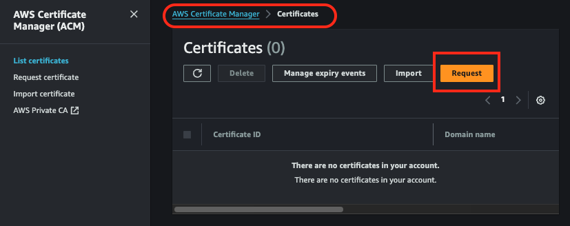

2. El certificado sera publico, ya que nuestra aplicacion sera accesible desde Internet.
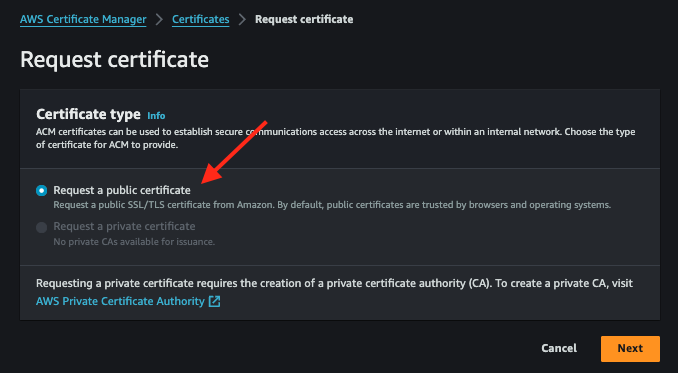

3. Agregamos los subdominios para los que queremos obtener el certificado.
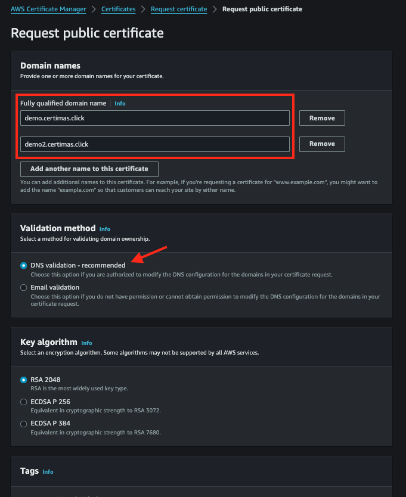

4.  Optaremos por la validacion por DNS, creando las entradas en Route53.
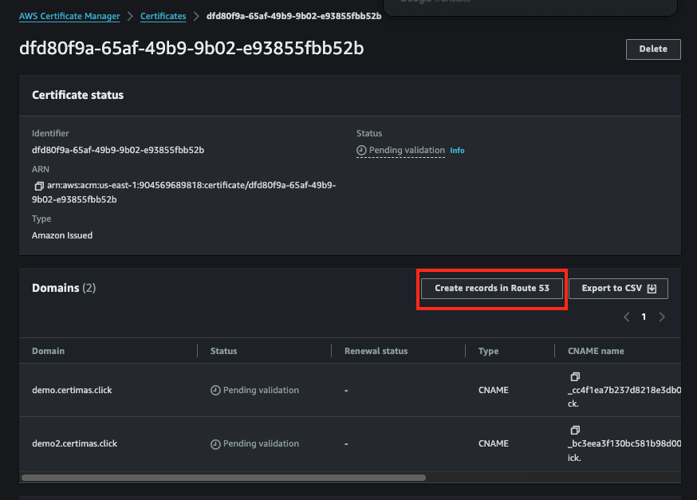

5. Validamos la obtencion del certificado.


## Creacion del balanceador de carga
1. Buscamos la consola de Balanceadores de carga en EC2 y creamos un nuevo balanceador.
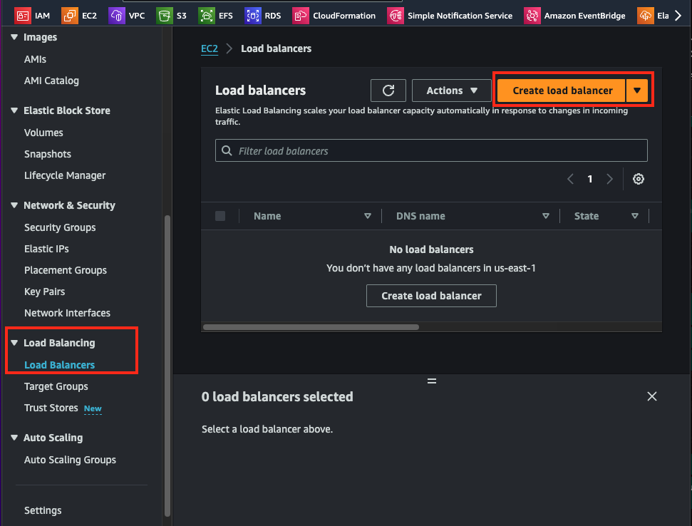

2. Escogemos por esta vez un Aplication Load Balancer.
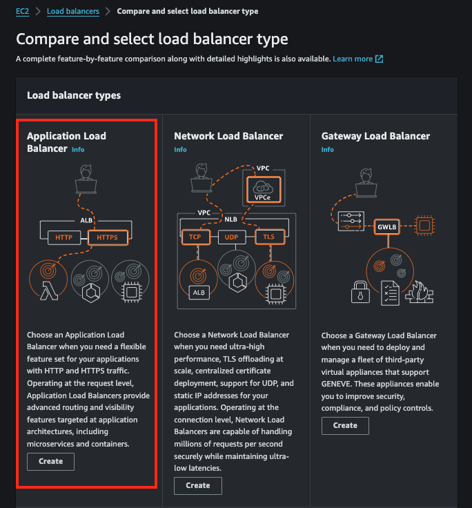

3. Especificamos el nombre de balanceador de carga, sera uno con salida a Internet para nuestra aplicacion web. A nivel de red solo usamos IPv4.
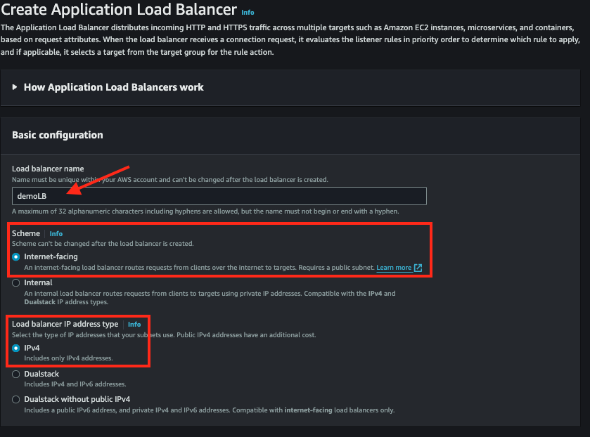

4. Escogemos la VPC de preferencia y en que zonas de disponibilidad se encontraran las instancias entre las que se balanceara el trafico.
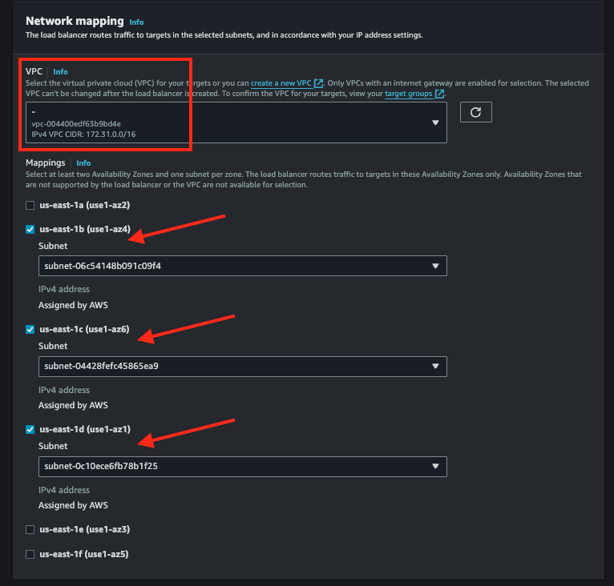

5. El Load Balancer tambien tendra su propio grupo de seguridad, para limitar el trafico.
En este paso nos toca seleccionar EL TARGET GROUP, asi que crearemos uno dandole click a "Create target group" y se abrira otra pestana externa:
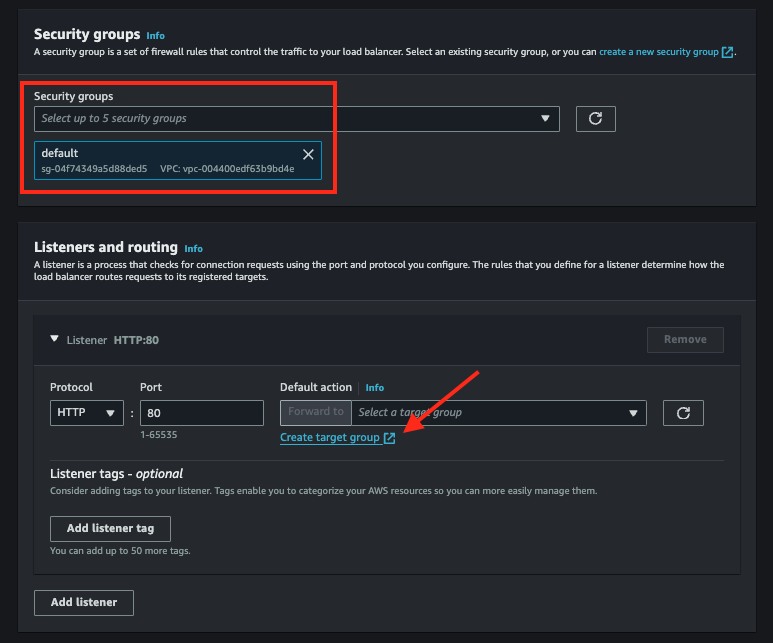

    ### Creacion del target group
    1. Escogemos INSTANCES como Target. Y colocamos un nombre al TG.
    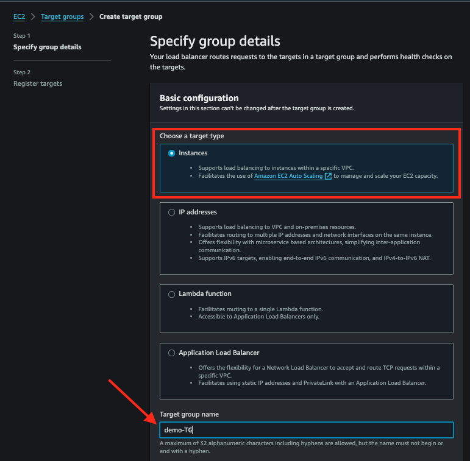

    2. Importante definir el puerto en el que va a correr la aplicacion dentro de las isntancias. En nuestro caso sera una aplicacion Flask corriendo en el puerto 5000.
    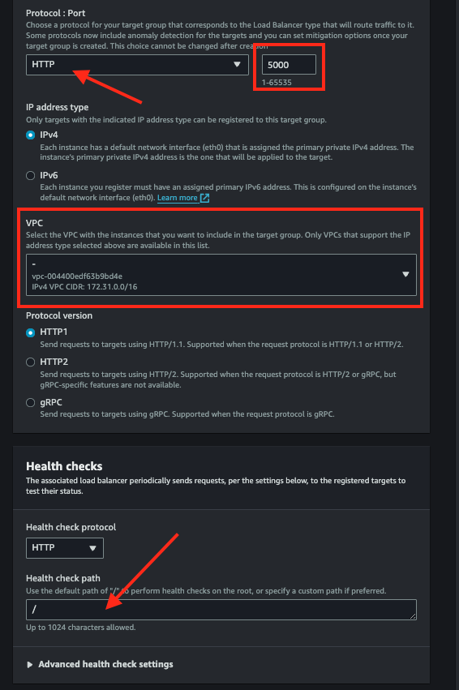

    3. Aun no registramos targets, esto lo haremos desde la pagina del grupo de autoescalamiento.
    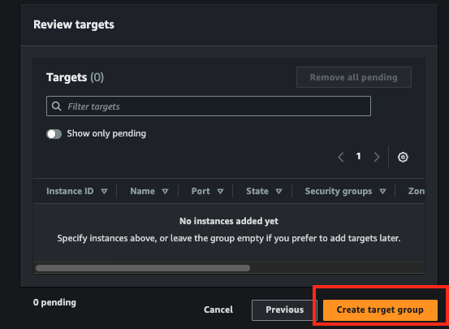

6. Volvemos a la pagina del balanceador y recargamos, ahora si encontraremos el Target Group.
Ahora procedemos a crear los listeners, que representan los puertos donde el balanceador de carga escuchara el trafico.
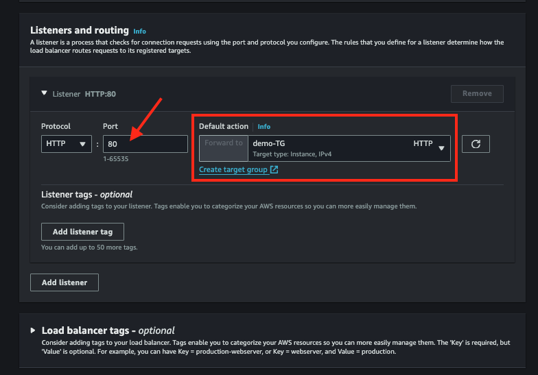
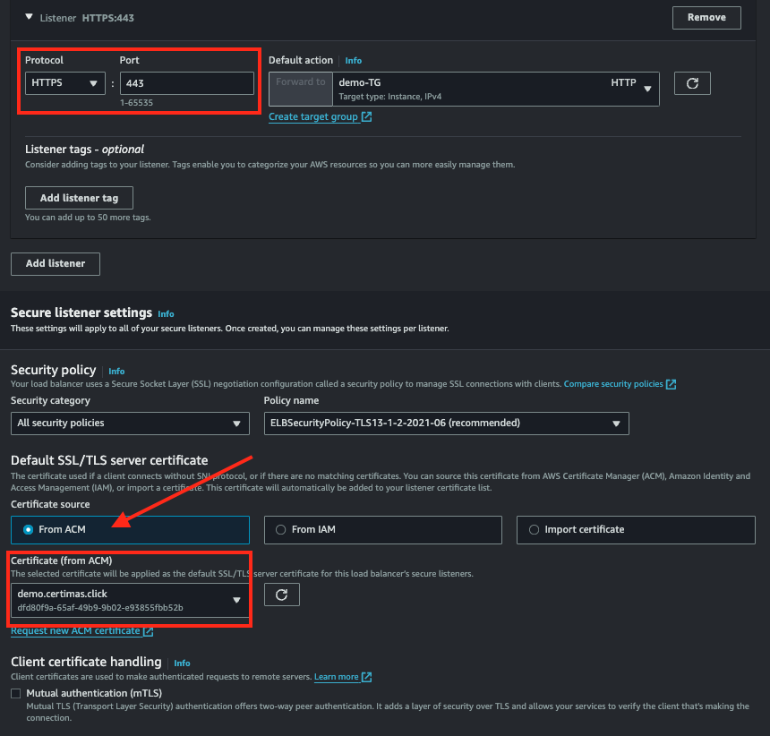


## Creacion del grupo de autoescalamiento
1. Vamos a la consola de EC2, en la seccion AutoScaling Group y creamos un nuevo grupo.


2. Iniciamos con la plantilla de creacion, le ponemos un nombre al grupo, crearemos desde esta vista un LAUNCH TEMPLATE, lo cual abrira una nueva pestana.
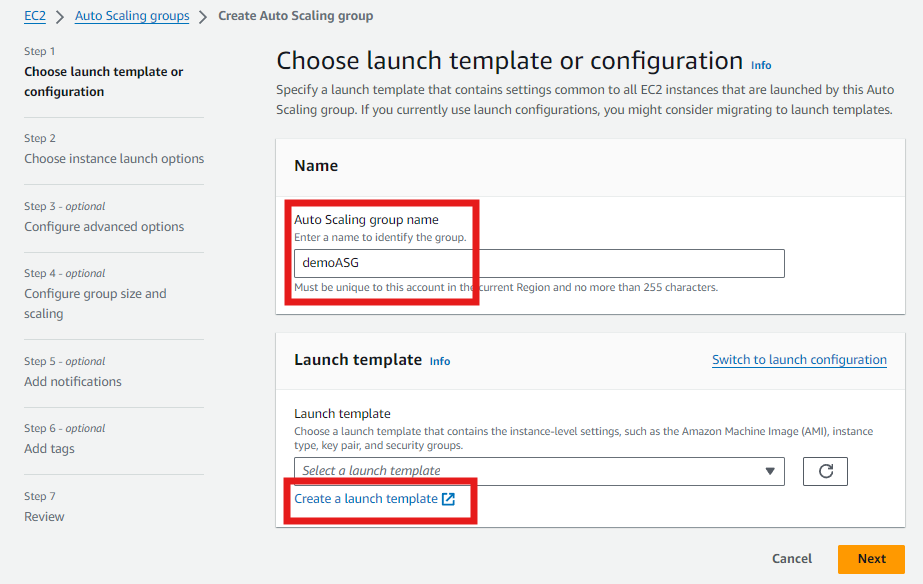

    ### CREACION DEL LAUNCH TEMPLATE  
    1. Pasamos a crear el launch template, donde definimos las configuraciones de las instancias que seran lanzadas por AWS cuando se requiera escalar.
    Enviamos un nombre a la plantilla y marcamos la casilla de GUIA PARA EC2 AUTOSCALING.
    

    2. Como AMI usamos Amazon Linux 2 que encontramos en Quick Start.
    

    3. Escogemos el tipo de instancia y un par de llaves. 
    CONFIGURACION DE RED: NO INCLUIREMOS CONFIGURACION DE SUBNET NI GRUPOS DE SEGURIDAD (IMPORTANTE).
    
    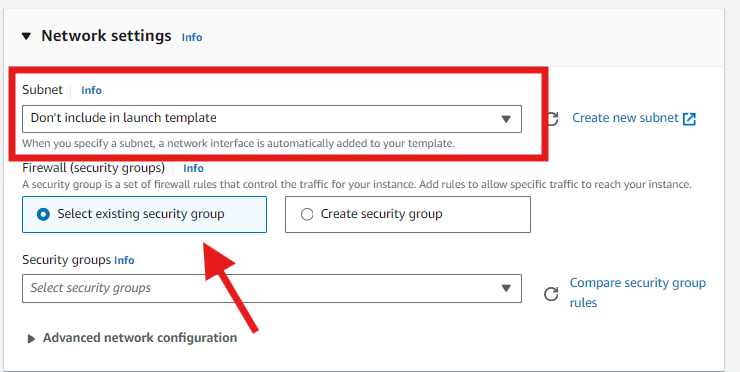

    4. En advaced details agregamos el siguiente script en USER DATA.

```bash
#!/bin/bash
# Actualizar el sistema e instalar Python y pip
yum update -y
yum install -y python3 python3-pip

# Instalar Flask
pip3 install flask

TOKEN=`curl -X PUT "http://169.254.169.254/latest/api/token" -H "X-aws-ec2-metadata-token-ttl-seconds: 21600"`

INSTANCE_ID=$(curl -H "X-aws-ec2-metadata-token: $TOKEN" -s http://169.254.169.254/latest/meta-data/instance-id)
PUBLIC_IP=$(curl -H "X-aws-ec2-metadata-token: $TOKEN" -s http://169.254.169.254/latest/meta-data/public-ipv4)


# Crear la aplicación Flask
mkdir -p /home/ec2-user/flask_app
cat <<EOF > /home/ec2-user/flask_app/app.py
from flask import Flask
app = Flask(__name__)

@app.route('/')
def index():
    instance_id = "${INSTANCE_ID}"
    private_ip = "${PRIVATE_IP}"
    return f'''
    <!DOCTYPE html>
    <html lang="en">
    <head>
        <meta charset="UTF-8">
        <meta name="viewport" content="width=device-width, initial-scale=1.0">
        <title>My EC2 Instance</title>
        <style>
            body {{
                font-family: Arial, sans-serif;
                background-color: #f4f4f4;
                margin: 0;
                padding: 0;
                display: flex;
                justify-content: center;
                align-items: center;
                height: 100vh;
            }}
            .container {{
                background-color: #fff;
                padding: 20px;
                box-shadow: 0 0 10px rgba(0, 0, 0, 0.1);
                text-align: center;
            }}
            h1 {{
                color: #333;
            }}
            p {{
                color: #666;
            }}
        </style>
    </head>
    <body>
        <div class="container">
            <h1>Welcome to my EC2 instance!</h1>
            <p><strong>Instance ID:</strong> {instance_id}</p>
            <p><strong>Private IP:</strong> {private_ip}</p>
        </div>
    </body>
    </html>
    '''

if __name__ == "__main__":
    app.run(host='0.0.0.0', port=5000)
EOF

# Crear un servicio systemd para la aplicación Flask
cat <<EOF > /etc/systemd/system/flask_app.service
[Unit]
Description=Flask Application

[Service]
ExecStart=/usr/bin/python3 /home/ec2-user/flask_app/app.py
WorkingDirectory=/home/ec2-user/flask_app
User=ec2-user
Restart=always

[Install]
WantedBy=multi-user.target
EOF

# Iniciar y habilitar el servicio Flask
systemctl start flask_app
systemctl enable flask_app
```

    5. Con esto terminamos la creacion del launch template.

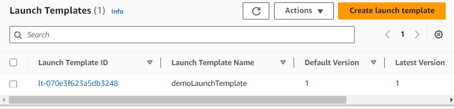

3. Ahora retornamos a la ventana de AutoScaling, actualizamos y cargamos el Launch template que creamos anteriormente.


4. En este segunda seccion configuramos las zonas de disponibilidad donde se distribuiran las instancias cuando haya escalamiento.
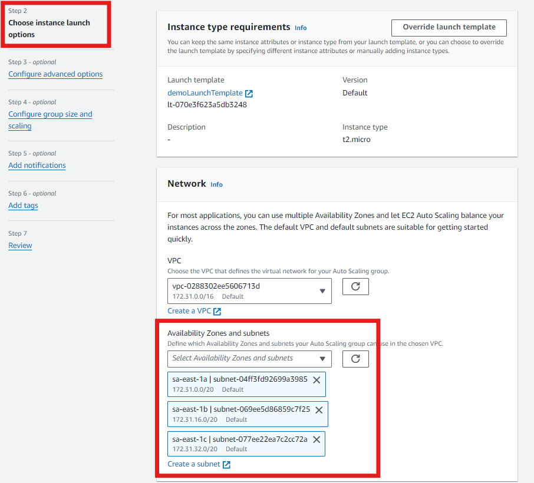


5. 
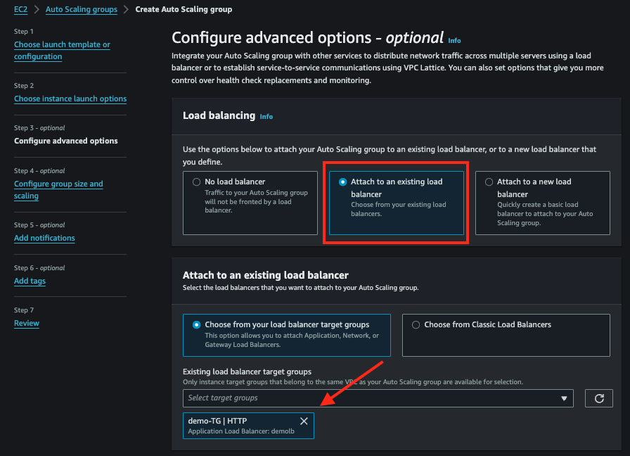

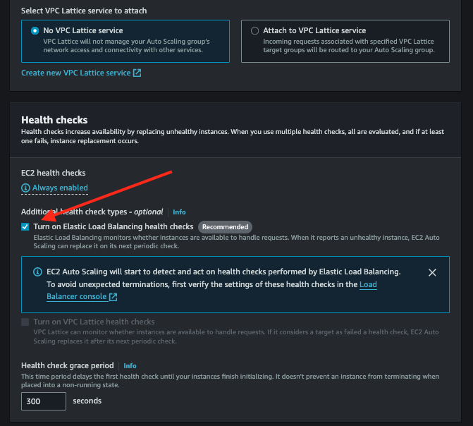


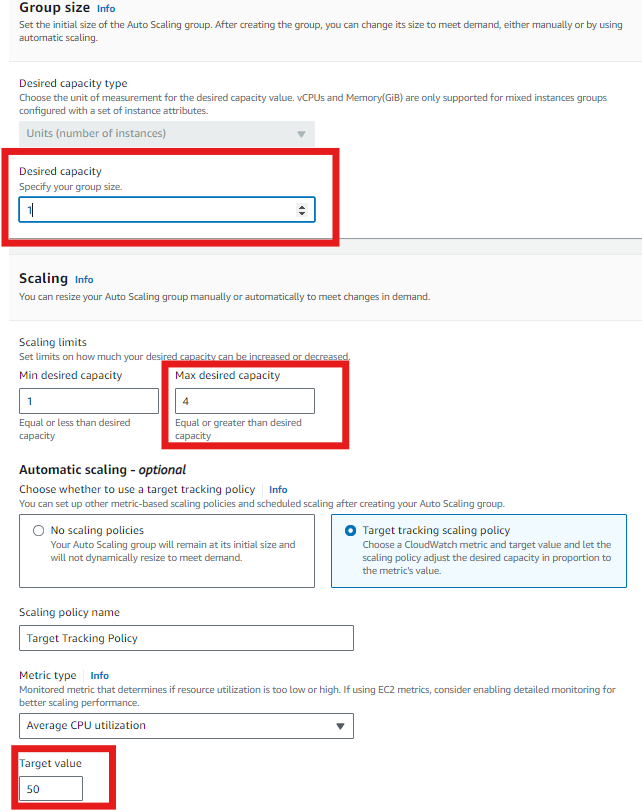


1. Ingresamos a una de las instancias y probamos un comando para cargar el cpu a su maxima utilizacion y validamos las reglas de escalamiento.

```bash
sudo amazon-linux-extras install epel -y
sudo yum install stress -y
stress --cpu 8 --timeout 600
```