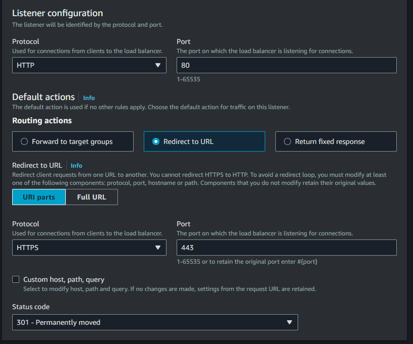
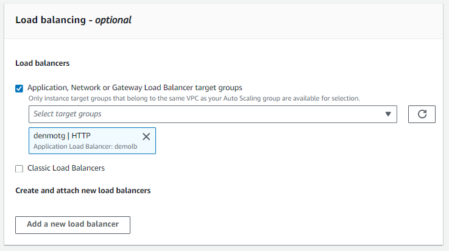

# LABORATORIO EC2 + LOAD BALANCER

Region: Virginia (us-east-1)

1. Desplegamos una instancia Wordpress **"WordPress Certified by Bitnami and Automattic"**. Usamos el grupo de seguridad que permite SSH, HTTP y HTTPS.


    ```
        usernameSSH: bitnami
    ```
    Despues de un par de minutos. Deberiamos poder acceder a la pagina mediante su IP publica.
    
    **En que puertos esta la instancia corriendo el servicio web? 🧐**

2. Creamos el Application Load Balancer.
    - Especificamos el nombre, sera de tipo Internet-facing y solo IPv4.
    - Ojo aqui, debe estar en la red donde se encuentra nuestra isntancia.
    - Usamos el grupo de seguridad: WebLoadBalancerSG-HTTPS-HTTP.
    - Creamos un Target Group y usamos listeners para el 80 y 443. 
    - El listener del 443 nos abre la opcion de insertar el certificado de mi dominio **mluna.certimas.click**.

3. Configuramos la ruta de route53 para apuntar al balanceador de carga. 


4. PLUS. Por temas de seguridad debemos deshabilitar el HTTP listener, pero para dar disponibilidad usamos el redireccinamiento.

    


# LABORATORIO EC2 + AUTOSCALING + LOAD BALANCER
REGION: N. Virginia

1. Creamos un launch template, definiendo la imagen amazon linux 2 y la costumizamos con user_data, SG, keys y mas. NO elegimos la subred, eso lo haremos al usar el template mas adelante.

2. Creamos un grupo de autoscaling, definimos el launch template. 
- Tambien definimos la VPC y AZ, datos que se deben usar tambien cuando creemos el LB.
- Opcionalmente podemos escoger el LB o crear uno desde cero (Si queremos agregar listener con certificado hacerlo desde la propia consola del LB). Habilitamos el healthcheck.
- Group size and scaling: Definimos la capacida minima, maxima y deseada.
- Podemos habilitar el escalado automatico con politicas de tracking de recursos.

3. Creamos un Target Group apuntando a las instancias y lo usamos para crear el balanceador.

4. Pasamos a editar grupo de autoescalamiento para agregarle un balanceador de carga


