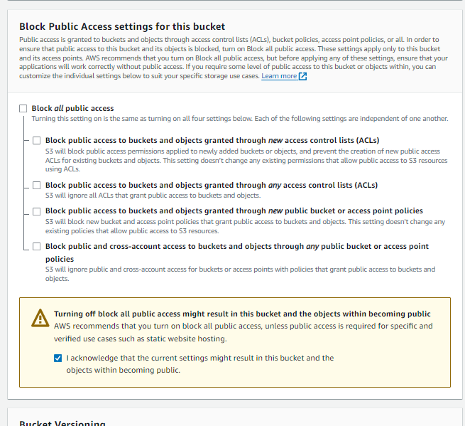
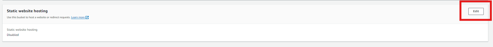
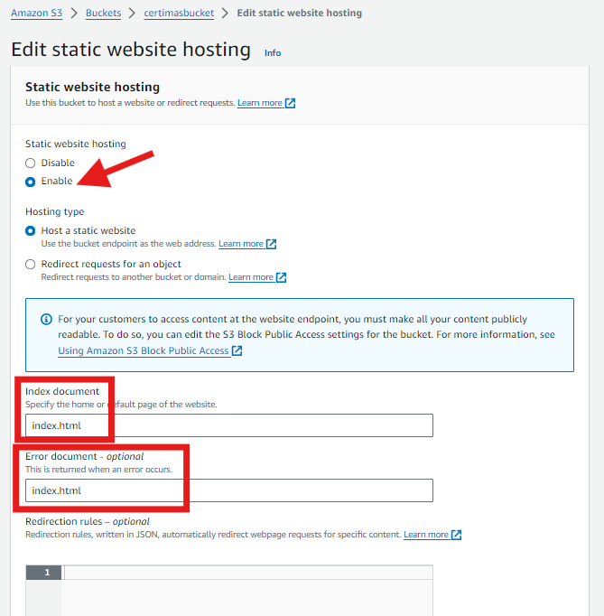
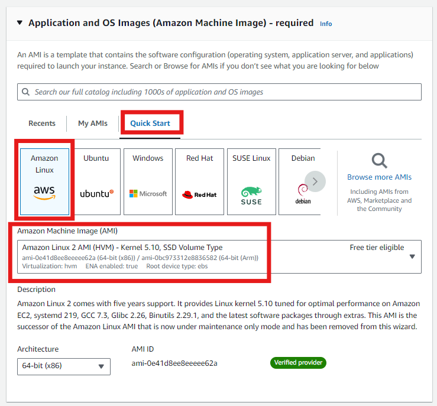
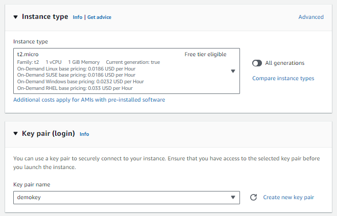
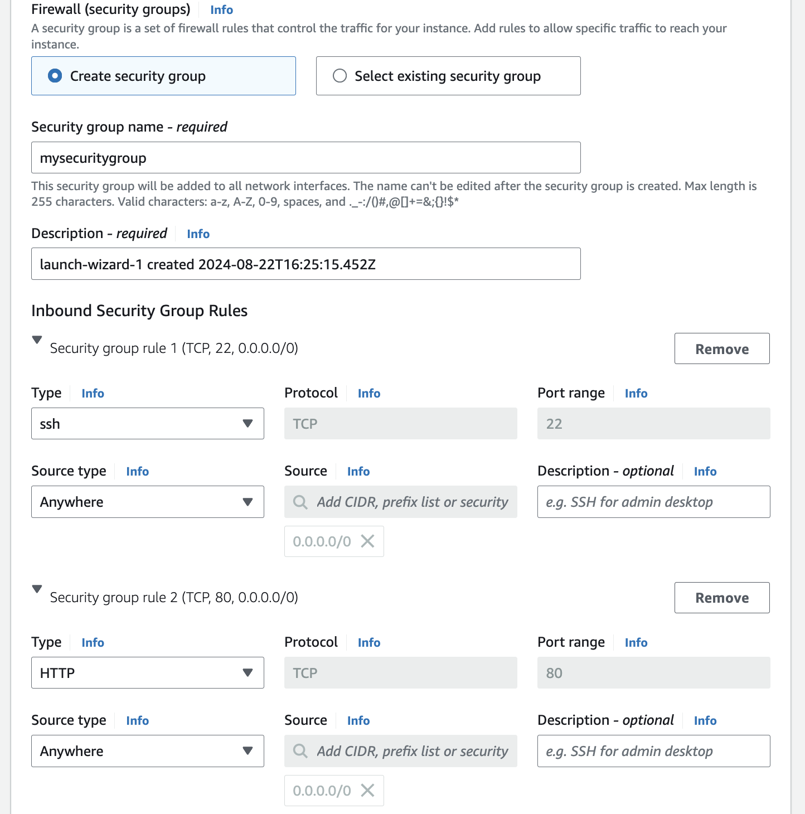

# ALOJA TU PRIMERA PAGINA WEB EN AWS: EC2 Y S3

## S3: WEB PAGE
### Configuracion de bucket S3
1. Creamos un bucket S3 en la nuestra region favorita.
OJO: Al momento de crear el bucket aseguremonos de hacerlo publico. 


Subimos los archivos de la carpeta "webejemplo" que encontramos en el repositorio. Esto lo podemos hacer por consola o por CLI.
Tambien puedes descargar tu propia pagina web en este repositorio: https://www.free-css.com/free-css-templates

```bash
aws s3 sync webejemplo/ s3://myownbucketmluna
```

2. Ahora debemos habilitar la opcion de hosting de web estatica, esto en la seccion "Properties" y configuramos los nombres de los archivos.



3. Ya en el bucket, editamos las politicas para permitir el acceso publico a los objetos del bucket.
```json
{
	"Version": "2012-10-17",
	"Statement": [
		{
			"Sid": "Permitall",
			"Principal": "*",
			"Effect": "Allow",
			"Action": [
				"s3:*"
			],
			"Resource": [
				"arn:aws:s3:::myownbucketmluna/*"
			]
		}
	]
}
```

3. Prueba de seguridad:
```bash
curl -X DELETE '<OBJECT URL>'
```
Se borro el objeto? Si es asi, intenta mejorar la politica del bucket y hacerla mas restrictiva.

## EC2: WEB PAGE
### CREACION DE LA INSTANCIA EC2
1. Vamos a la consola de EC2, en el dashboard de instancias damos click a "Launch instances". Esto nos lleva a la vista de configuracion de la instancia, procedemos a darle un nombre.

2. Como AMI usamos Amazon Linux 2 que encontramos en Quick Start.
    

3. Escogemos el tipo de instancia y un par de llaves[las llaves son opcionales].
    

4. En la seccion de networking, asegurarnos de tener una IP publica para la instancia. Para el firewall, crearemos nuestro grupo de seguridad donde permitiremos el trafico HTTP y SSH.




5. En advaced details agregamos el siguiente script en USER DATA.

```bash
#!/bin/bash
# Actualizar el sistema e instalar Python y pip
yum update -y
yum install -y python3 python3-pip

# Instalar Flask
pip3 install flask

TOKEN=`curl -X PUT "http://169.254.169.254/latest/api/token" -H "X-aws-ec2-metadata-token-ttl-seconds: 21600"`

INSTANCE_ID=$(curl -H "X-aws-ec2-metadata-token: $TOKEN" -s http://169.254.169.254/latest/meta-data/instance-id)
PUBLIC_IP=$(curl -H "X-aws-ec2-metadata-token: $TOKEN" -s http://169.254.169.254/latest/meta-data/public-ipv4)


# Crear la aplicación Flask
mkdir -p /home/ec2-user/flask_app
cat <<EOF > /home/ec2-user/flask_app/app.py
from flask import Flask
app = Flask(__name__)

@app.route('/')
def index():
    instance_id = "${INSTANCE_ID}"
    private_ip = "${PUBLIC_IP}"
    return f'''
    <!DOCTYPE html>
    <html lang="en">
    <head>
        <meta charset="UTF-8">
        <meta name="viewport" content="width=device-width, initial-scale=1.0">
        <title>My EC2 Instance</title>
        <style>
            body {{
                font-family: Arial, sans-serif;
                background-color: #f4f4f4;
                margin: 0;
                padding: 0;
                display: flex;
                justify-content: center;
                align-items: center;
                height: 100vh;
            }}
            .container {{
                background-color: #fff;
                padding: 20px;
                box-shadow: 0 0 10px rgba(0, 0, 0, 0.1);
                text-align: center;
            }}
            h1 {{
                color: #333;
            }}
            p {{
                color: #666;
            }}
        </style>
    </head>
    <body>
        <div class="container">
            <h1>Welcome to my EC2 instance!</h1>
            <p><strong>Instance ID:</strong> {instance_id}</p>
            <p><strong>Private IP:</strong> {private_ip}</p>
        </div>
    </body>
    </html>
    '''

if __name__ == "__main__":
    app.run(host='0.0.0.0', port=5000)
EOF

# Crear un servicio systemd para la aplicación Flask
cat <<EOF > /etc/systemd/system/flask_app.service
[Unit]
Description=Flask Application

[Service]
ExecStart=/usr/bin/python3 /home/ec2-user/flask_app/app.py
WorkingDirectory=/home/ec2-user/flask_app
User=ec2-user
Restart=always

[Install]
WantedBy=multi-user.target
EOF

# Iniciar y habilitar el servicio Flask
systemctl start flask_app
systemctl enable flask_app
```

6. Lanzamos la instancia, esperamos a que cargue y verificamos si se levanta nuestra aplicacion Flask consultando la IP publica. 
OJO: Recordar que estamos levantando la aplicacion Flask en el puerto 5000, por lo que es importante revisar las reglas del FW.