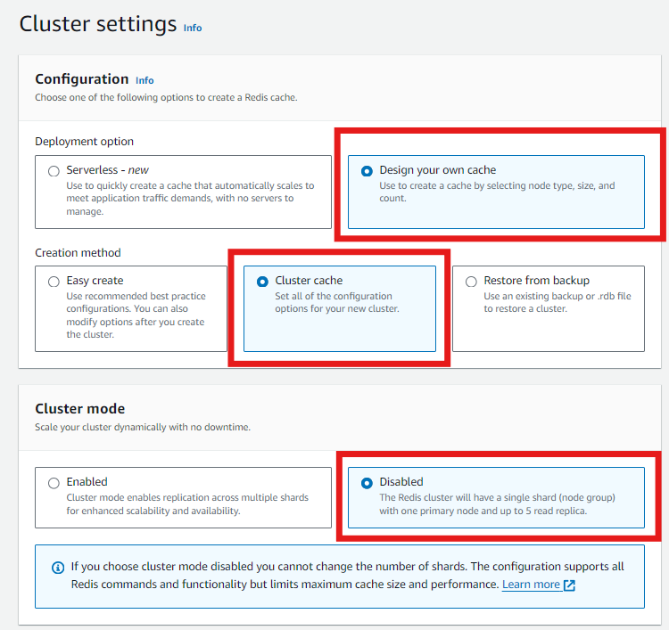
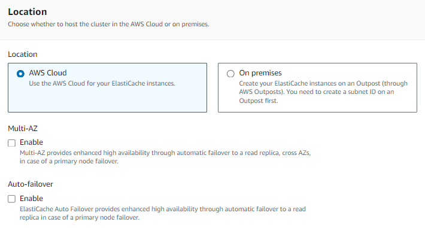
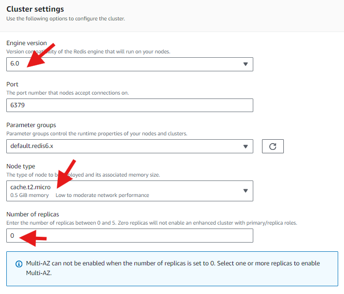
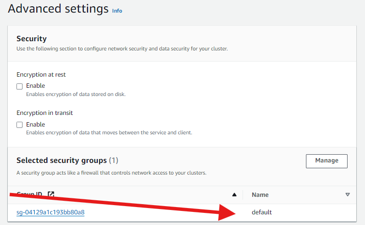

# ELASTICACHED LABORATORIO

1. Crearemos un Elasticache Redis: 


2. Crearemos nuestro propio cache, lo que nos permite mayor personalizacion. 
En cuanto al modo de cluster, lo dejaremos deshabilitado ya que no requerimos escalamiento.
IMPORTANTE: En caso se evalue un escalamiento se debe habilitar el modo CLUSTER para agregar luego mas SHARDS.


3. NO habilitaremos las opciones de failover ni de MultiAZ por ser una prueba rapida.


4. En cuanto a los parametros de Cluster REDIS tenemos lo siguiente:
- Version del motor REDIS 6.0
- Tipo de nodo t2.micro
- Dejamos en CERO en # de replicas, solo queremos un nodo.


5. En opciones avanzadas solo agregamos el grupo de seguridad por defecto.



## APLICACION WEB EN EC2
1. Creamos una isntancia EC2 que tenga IP publica para poder acceder, como USER DATA usaremos el siguiente script:

IMPORTANTE: !!!
Actualizar el endpoint de redis en el USER DATA.

```bash
#!/bin/bash
sudo yum -y install git
sudo yum -y install python3
sudo pip3 install virtualenv
git clone https://github.com/aws-samples/amazon-elasticache-samples/
cd amazon-elasticache-samples/session-store
virtualenv venv
source ./venv/bin/activate
pip3 install -r requirements.txt
export REDIS_URL="redis://demoredis.th5rhu.ng.0001.sae1.cache.amazonaws.com:6379"
export FLASK_APP=example-4.py
export SECRET_KEY=some_secret_string
flask run -h 0.0.0.0 -p 5000 --reload
```

Una vez iniciada la instancia en el navegador cargamos la IP publica en el puerto 5000 y la ruta /login:
http://54.207.109.222:5000/login


El script se almacena en: 
/amazon-elasticache-samples/session-store