# RDS LABORATORIO

### CREACION DE LA BASE DE DATOS RDS MYSQL

1. Ir a la consola de RDS y seleccionar CREATE DATABASE.
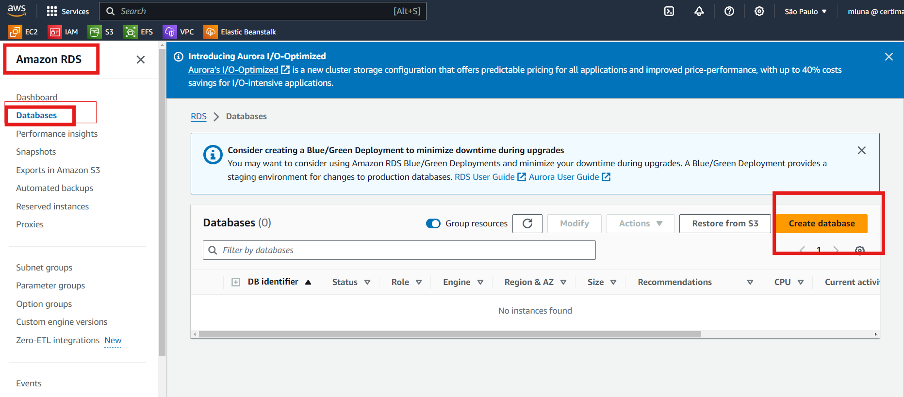

2. Usaremos el metodo de creacion ESTANDAR, para poder verificar la variedad de opciones costumizables que tenemos en RDS.
AWS RDS provee 6 motores de base de datos, seleccionaremos MySQL, ya que es parte del free tier.
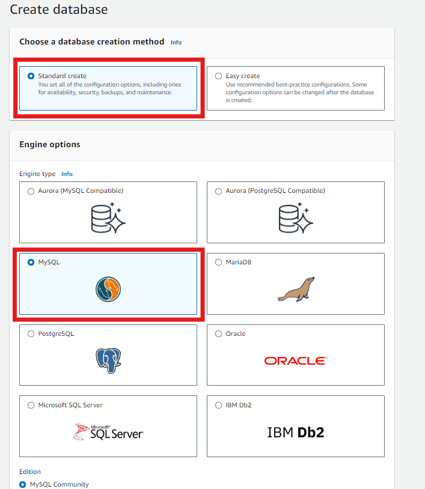

3. Seleccionamos la version 5.7.44 de MySQL. Seleccionamos RDS Extended Support ya que estamos usando una version que AWS ya retiro de soporte.
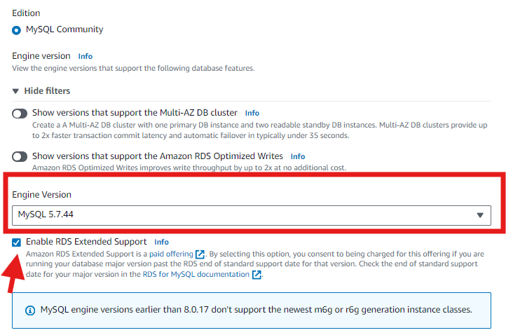

4. En cuanto al modo de despliegue vamos con la opcion de Free tier, este modo es ideal para pruebas, PoC y ambientes de testing. NO SE RECOMIENDA PARA PRODUCCION.
Para produccion seria ideal ir con las plantillas Production o dev/test que permiten habilitad las diferentes modalidades de despliegue.
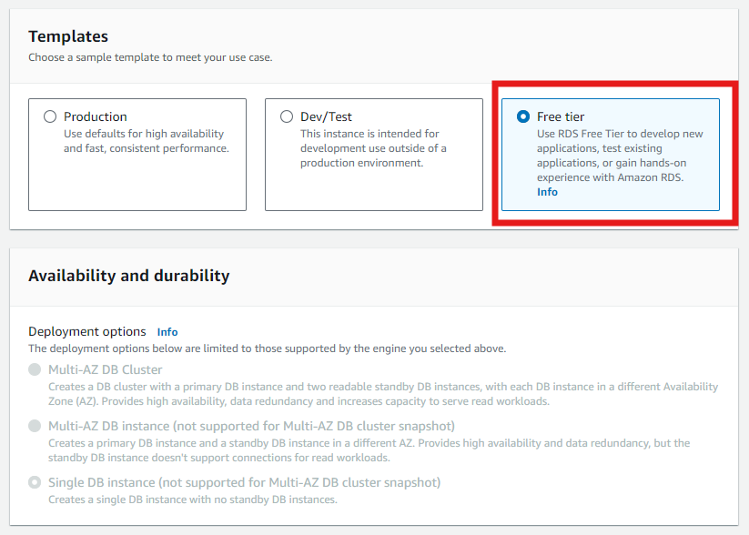

5. Ahora configuraremos parametros de la instancia RDS, el nombre y las credenciales (username y password). Almacenar las credenciales, las usaremos mas adelante.
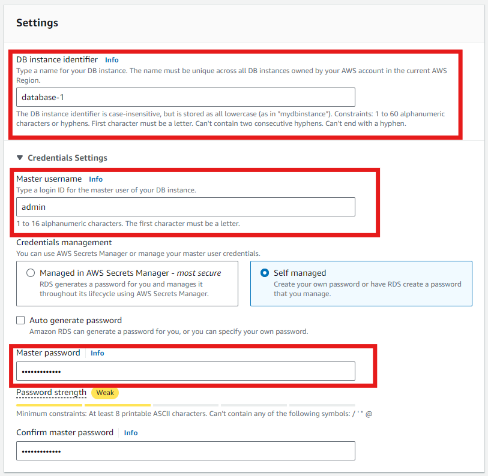

6. RDS nos permite selecciona el tipo de instancia que mas se adecue a los requerimientos de HW de la aplicacion. Esta vez escogeremos las de tipo t, burstable que estan dentro del free tier.
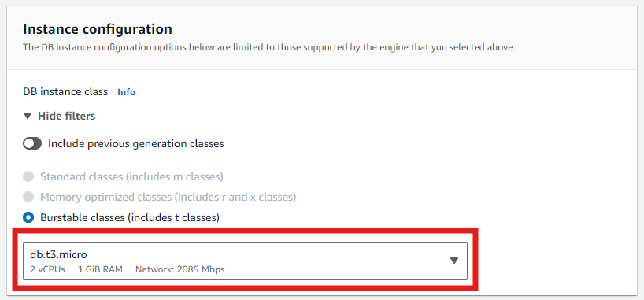

7. En la seccion de storage, iremos con 20GB tipo SSD. Podemos seleccionar el escalamiento automatico y definir un limite de forma opcional.
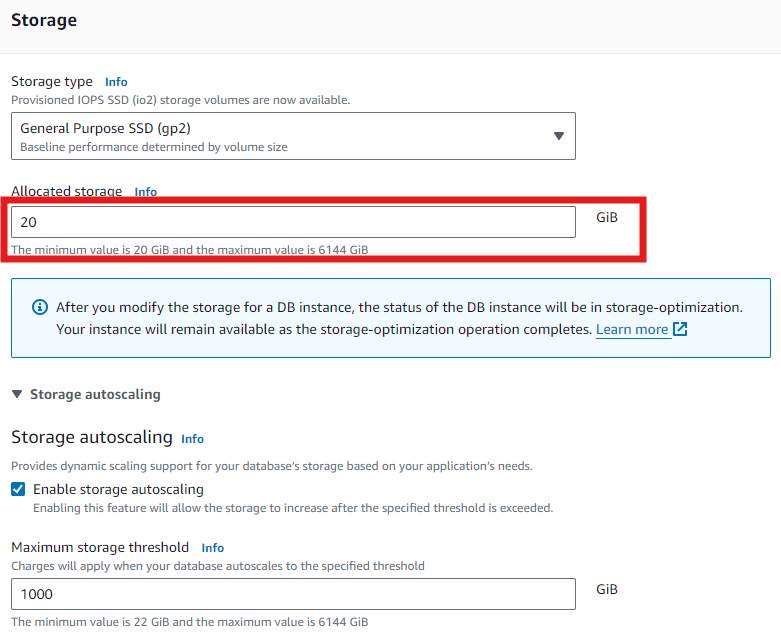

8. En cuanto a conectividad: 
    - escogemos la VPC y permitimos el acceso publico, solo por propositos de pruebas. 
    - De forma opcional pueden crear su propio grupo de seguridad para limitar las conexiones.
    - Si se tiene mapeado elegir la mejor AZ o por defecto AWS elegira en que AZ se desplegara.
    - Usamos el puerto por defecto de MySQL 
    **3306**.

    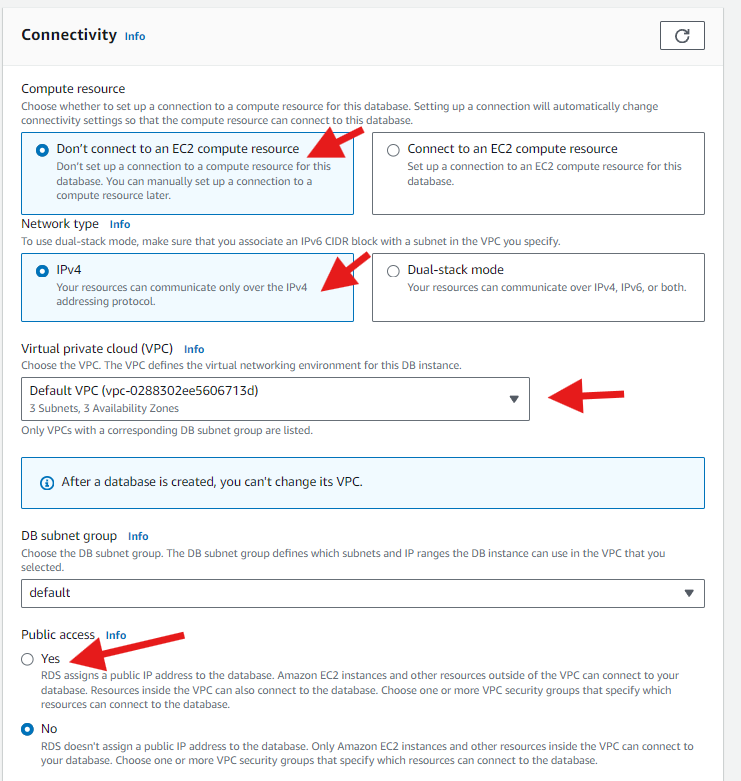

    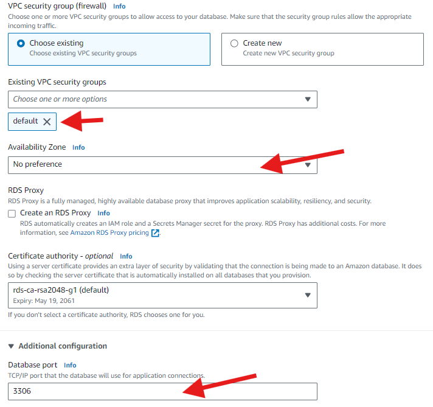
    - Para la autenticacion usaremos la basica por credenciales previamente especificados.
    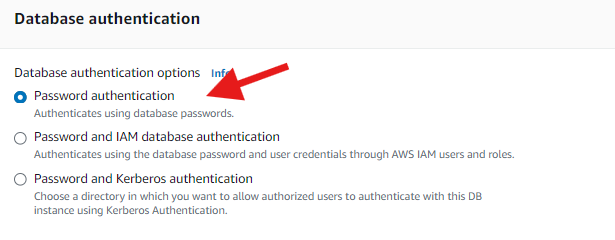

9. En configuracion adicional especificamos el nombre de la base de datos inicial para la instancia RDS que estamos configurando. La nombraremos **empleados**, lo demas lo dejaremos por defecto.
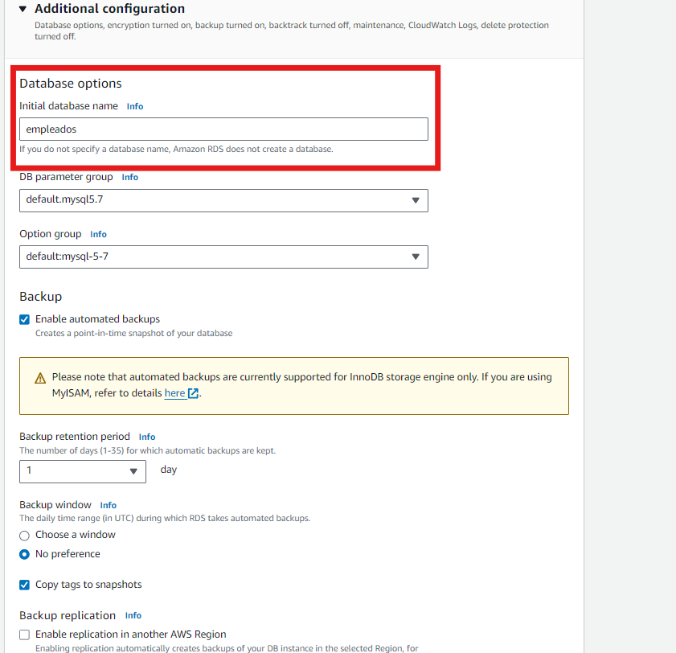


### CREACION DE LA INSTANCIA EC2 
1. Creamos una instancia EC2 con AMI Amazon Linux 2.
    - Asegurarse de que la instancia tenga una IP publica para poder acceder a la aplicacion.
    - En la seccion ADVANCED DETAILS copiamos el sgt script en USER DATA.

```bash
#!/bin/bash
yum -y update
yum -y install php73
sudo amazon-linux-extras install -y php7.2
yum -y install httpd
usermod -a -G apache ec2-user
chown -R ec2-user:apache /var/www
chmod 2775 /var/www && find /var/www -type d -exec sudo chmod 2775 {} \;
find /var/www -type f -exec sudo chmod 0664 {} \;
systemctl start httpd
systemctl enable httpd
```


## CONFIGURACION WEB APP
1. Ingresamos a la consola de la instancia que acabamos de lanzar. Validamos que el USER DATA que pasamos se ejecuto con el siguiente comando: 
```bash
systemctl status httpd
```
El cual debe retornar el status del servidor Apache corriendo.
Tambien podemos acceder por el navegador a la IP publica.
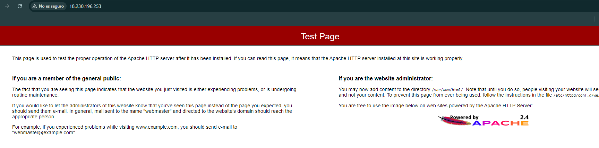

    En caso el servidor no este levantado, correr cada uno de los comandos del user data en la consola.

2. Crearemos los directorios y archivos del servidor para levantar una aplicacion web basica que se conecte al RDS.

Primero, en este repositorio ubicar el archivo dbinfo.inc, el cual editaremos con nuestros parametros.
 - Obtenemos el endpoint o cadena de conexion en la consola de RDS.
    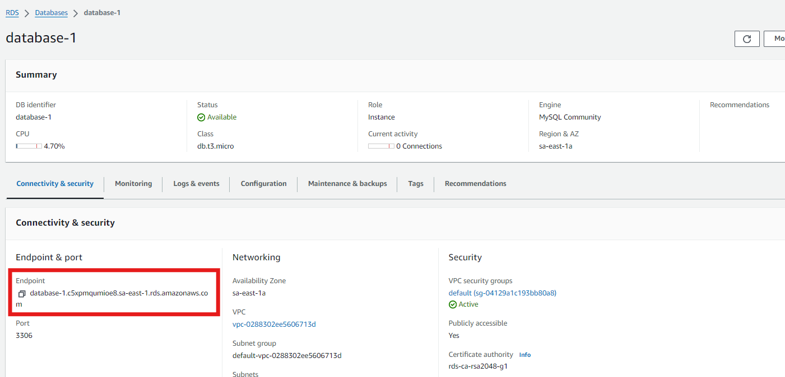
 - Las credenciales y nombre de la base de datos inicial los recordamos de los pasos anteriores. 

Ahora en la consola de la instancia EC2:

```bash
cd /var/www/ && mkdir inc && cd inc
nano dbinfo.inc
```

Copiar el contenido editado del archivo dbinfo.inc, IMPORTANTE!!! La configuracion varia, asegurate de haber editado la informacion de la base de datos con tus parametros. Este es un EJEMPLO:
```
<?php
define('DB_SERVER', 'database-1.c5xpmqumioe8.sa-east-1.rds.amazonaws.com');
define('DB_USERNAME', 'admin');
define('DB_PASSWORD', 'adminpassword');
define('DB_DATABASE', 'empleados');
?>
```
- Para salir del editor, CTRL+X , guardar el contenido y salir.

Ahora escribiremos un script PHP (archivo index.php) para la interface de la pagina web, este script carga la informacion de la base de datos del archivo dbinfo.inc que acabamos de editar.

```
cd /var/www/html
nano index.php
```

Recargamos la pagina web que apunta a la IP publica de la instancia, ya deberiamos ver los cambios:
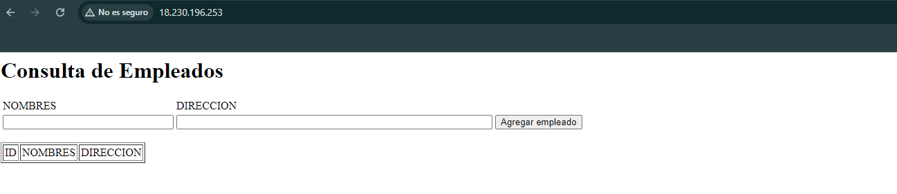


OPCIONAL:s
Mediante el cliente MySQL de tu preferencia puedes intentar acceder a tu base de datos, yo uso MySQL Workbench [https://dev.mysql.com/downloads/workbench/].

Agregamos una nueva conexion: 
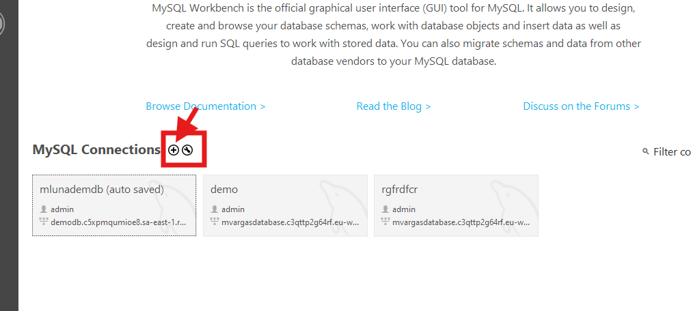

Aqui debemos especificar el endpoint de conexion en HOSTNAME, y el USERNAME de nuestra RDS.
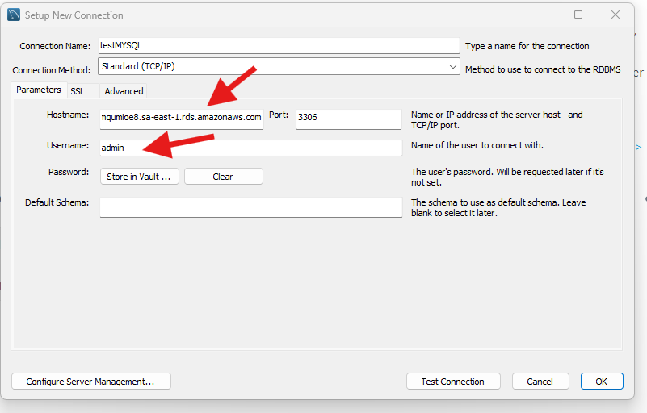

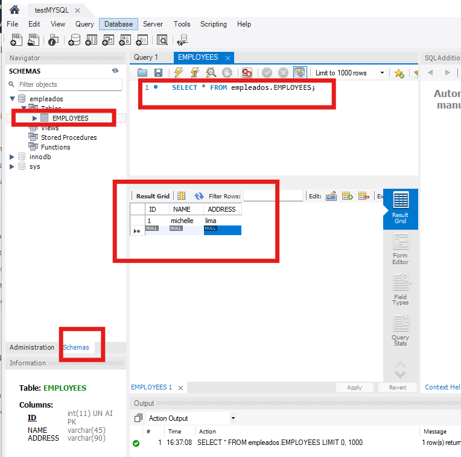